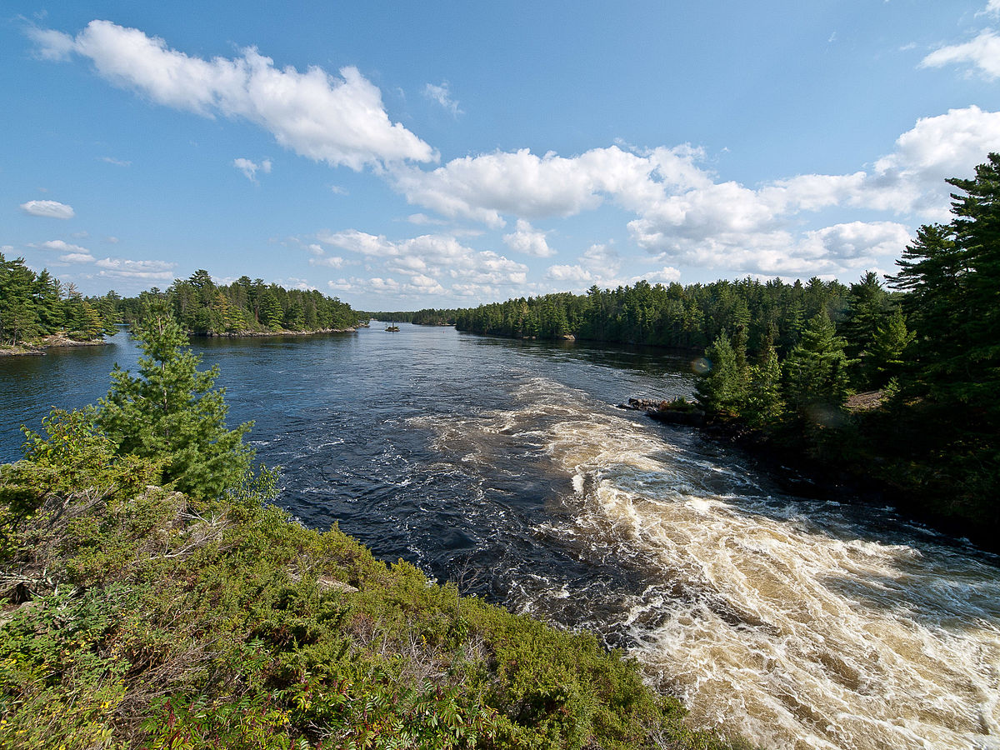

# Rainy Lake Hydrology

A collection of computational notebooks analyzing the hydrology of Rainy Lake on the Minnesota/Ontario border.

## Usage

An executable version of these notebooks can be loaded at [mybinder.org](http://mybinder.org) by clicking on the following link:

Alternatively, all of the code, data, and descriptive materials are available as public [github repository](https://github.com/jckantor/Rainy-Lake-Hydrology). The notebooks were developed and can be executed in the open source [Anaconda](https://www.continuum.io/downloads) python distribution available at no cost from [Continuum Analytics](https://www.continuum.io/).

## Presentations

A summary of presentations based on the data and calculations in this repository. 

* [Model predictive control strategies for implementing rule curves for the Namakan Reservoir / Rainy Lake Watershed](Watershed Forum 2015/Watershed_Forum_2015_Slides.pdf). Presented at the 2015 International Rainy-Lake of the Woods Watershed Forum, March 11-12, 2015, International Falls, MN.
* [Why is Rainy Lake so Difficult to Control?](RLPOA Open House 2015 Fort Frances/RLPOA_Open_House_2015_Slides.pdf) Presented to the Rainy Lake Property Owners Association, June 18, 2015, La Place Rendez-Vous, Fort Frances, Ontario.
*  [Why is Rainy Lake so Difficult to Control?](RLPOA Open House 2015 Thunderbird/RLPOA_Open_House_2015_Slides.pdf). Presented to the Rainy Lake Property Owners Association, August 6, 2015, Thunderbird Lodge, International Falls, Minnesota.

## Data Import & Cleansing

The following notebooks provide tools to access relevant level, flow, and precipitation data for an analysis of the hydrology of Rainy Lake. These notebooks 'pickle' relevant data series as Pandas series and dataframes for import into other notebooks.

* [Water Survey of Canada](notebooks/Water_Survey_of_Canada.ipynb). Reads data from the HYDAT data tables stored in CSV format. Creates a local HDF cache `data/hydat.h5` in the local repository for a given set of flow and level stations.
* [Namakan Lake Water Levels](notebooks/Namakan_Lake_Water_Levels.ipynb). Reads the WSC data cache to create a time series `data/NL.pkl` of historical levels for Namakan Lake. Level data from stations located at Namakan Lake above Kettle Falls and at Squirrel Island and are concatenated, with means used for overlapping dates.
* [Rainy Lake Water Levels](notebooks/Rainy_Lake_Water_Levels.ipynb). Reads the WSC data cache to create a reconciled time series `data/RL.pkl` of historical levels for Rainy Lake.  The difference in reconciled measurements at Bear's Pass and Fort Frances is used to estimate a standard error for lake level measurement.
* [Rainy River Flows](notebooks/Rainy_River_Flows.ipynb). Reads the WSC data cache to create a time series `data/RR.pkl` of historical flows for Rainy River.  
* [Global Historical Climatology Network](notebooks/Global_Historical_Climatology_Network.ipynb). Reads historical temperature and preciptation records for station KINL located at International Falls, Minnesota.
* [Ice Out Dates](notebooks/Ice_Out_Dates.ipynb). Creation of time series for historical ice-out dates on Rainy Lake using data from the Minnesota DNR.
* [Rule Curves for Rainy and Namakan Lakes](notebooks/Rule_Curves_for_Rainy_and_Namakan_Lakes.ipynb). Create a time series representation of rule curves for Rainy and Namakan Lakes.
* [Stage-Volume Relationships for Rainy and Namakan Lakes](notebooks/Stage-Volume_Relationships.ipynb). Regression of Stage-Volume data from the International Joint Commission for Rainy and Namakan Lakes.

## Analysis of Lake Level Behavior 1970-2010

* [Imputing an Effect of Rule Curve Changes on Rainy River Flows](notebooks/Imputing_an_Effect_of_Rule_Curve_Changes_on_Rainy_River_Flows.ipynb)
* [Changes in Rainy River Flows 1970-2010](notebooks/Changes_in_Rainy_River_Flows_1970-2010.ipynb)
* [Namakan and Rainy Lake Water Levels 1970-2010](notebooks/Namakan_and_Rainy_Lake_Water_Levels_1970-2010.ipynb)
* [Precipitation at Internatonal Falls 1970-2010](notebooks/Precipitation_at_International_Falls_1970-2010.ipynb)
* [Flow Constrictions on Upper Rainy River](notebooks/Flow_Constrictions_on_Upper_Rainy_River.ipynb)

## Mitigation through Advanced Control and Optimization ###

* [Matlab/Simulink Implementation of 2000 Rule Curves](matlab/Rainy_Lake_Simulation_Model.pdf) [[.m](https://github.com/jckantor/Rainy-Lake-Hydrology/blob/master/Rainy_Lake_Simulation_Model_Script.m)][[.mat](http://jckantor.github.io/Rainy-Lake-Hydrology/pdf/Rainy)][[.slx](https://github.com/jckantor/Rainy-Lake-Hydrology/blob/master/Rainy_Lake_Simulation_Model.slx)]
* [Estimating Rainy Lake Inflows 1971-2010](notebooks/Estimating_Rainy_Lake_Inflows_1971-2010.ipynb)
* [Ice-Out Predictor](notebooks/Ice_Out_Predictor_for_Rainy_Lake.ipynb)
* [Freshet Predictor](notebooks/Freshet_Predictor_for_Rainy_Lake.ipynb)
* [Lumped Parameter Model for Lake Dynamics](notebooks/Lumped_Parameter_Model_for_Lake_Dynamics.ipynb)
* [Feasibility of Rainy Lake Rule Curves](notebooks/Feasibility_of_Rainy_Lake_Rule_Curves.ipynb)
* [Harmonizing Rule Curves to Seasonal Inflow](notebooks/Harmonizing_Rule_Curves_to_Seasonal_Inflows.ipynb)
* Feedforward Control for the Dam at International Falls
* [Improved Prediction of Inflows (stub)](notebooks/Improved_Prediction_of_Inflows.ipynb)
* [Model Predictive Control of Dams at Kettle Falls and International Falls (stub)](notebooks/Model_Predictive_Control_of_Dams_at_Kettle_Falls_and_International_Falls.ipynb)